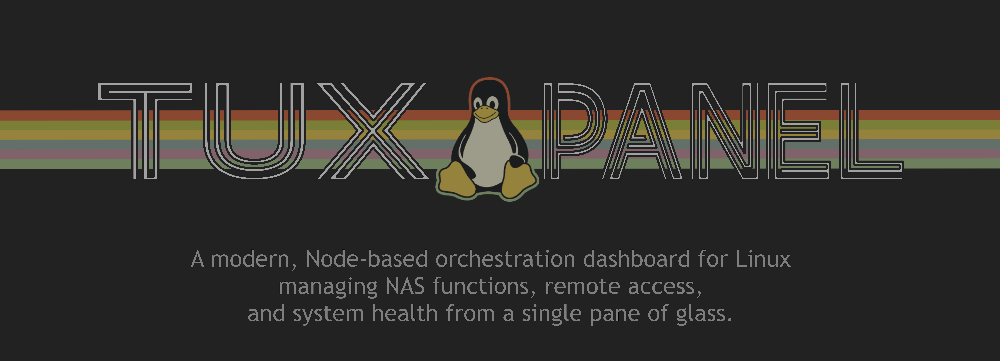
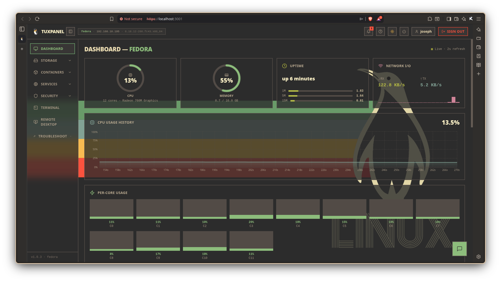
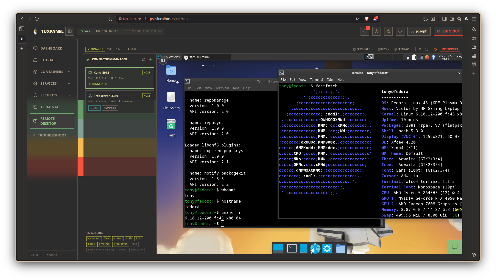
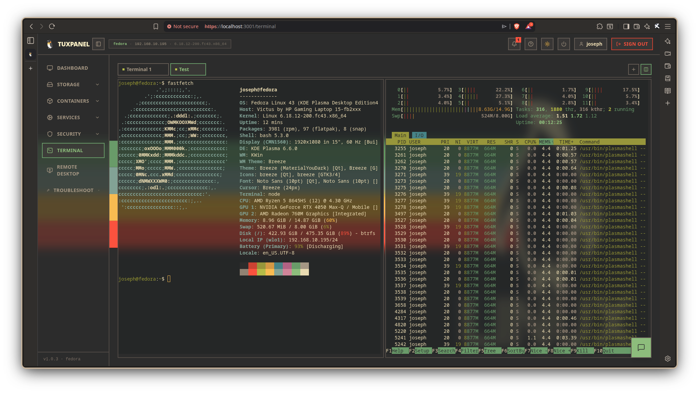
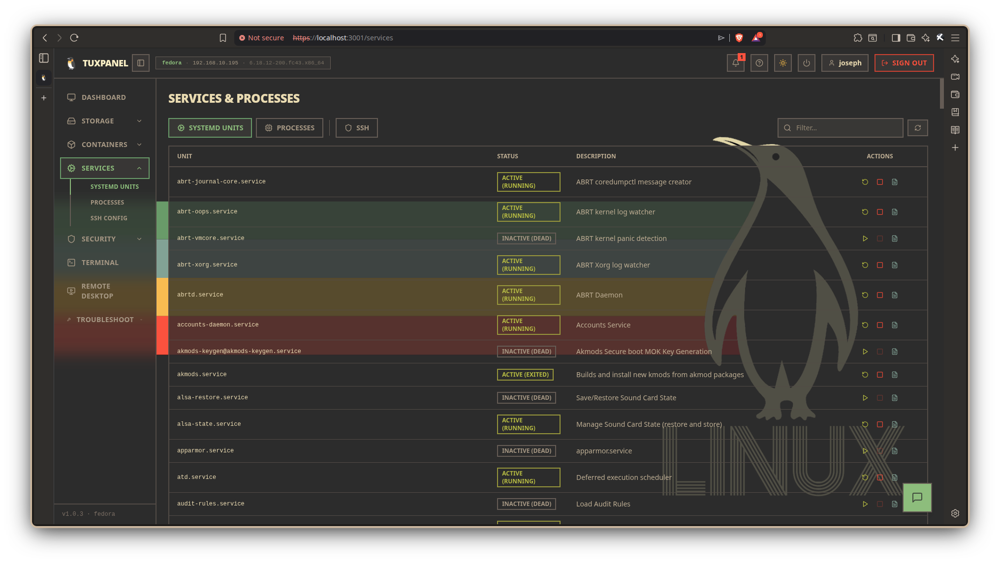
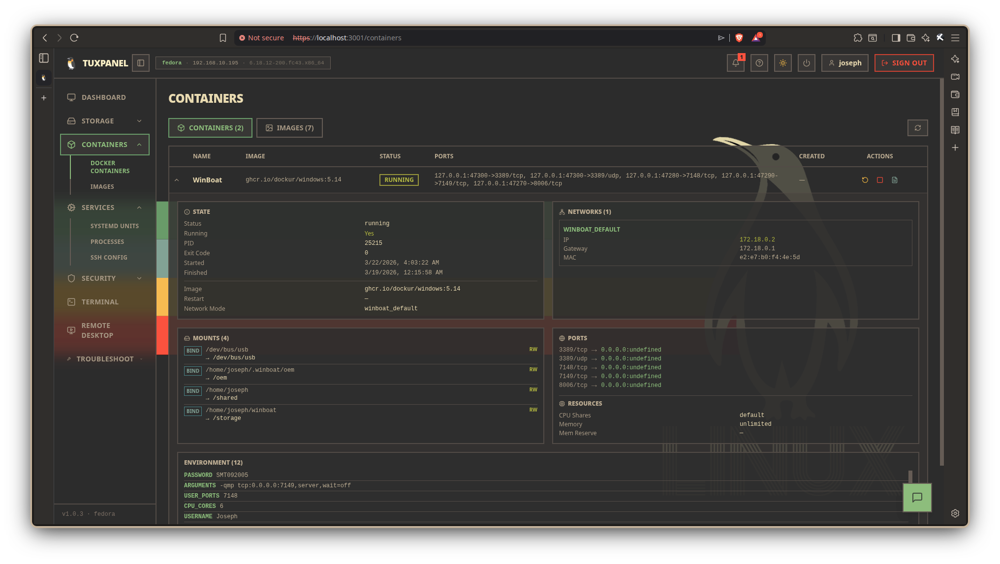
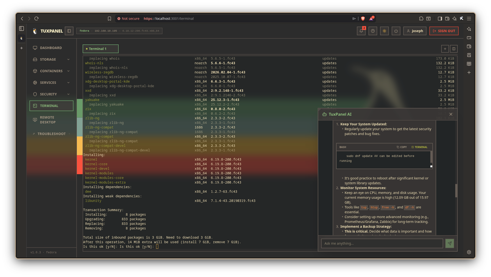

# 🐧 TuxPanel



**Built for modern Linux** with a reactive JS stack that replaces legacy PHP panels. Features a seamless Python-based graphical installer packaged as an AppImage for cross-distro compatibility.

---

## Tech Stack

| Layer       | Technology                                         |
| ----------- | -------------------------------------------------- |
| Frontend    | React 19, Tailwind CSS 4, Vite 6, xterm.js, noVNC |
| Backend     | Node.js 22, Express 4, Socket.io 4, TypeScript     |
| Installer   | Python 3, PyQt6, AppImage, Polkit                  |
| Integration | node-pty (terminal), noVNC + VNC/RDP discovery (remote desktop) |
| System      | systemd, Samba, NFS, Docker, firewalld, SELinux    |

---

## Project Structure

```text
tux-panel/
├── client/                  # React frontend (Vite)
│   ├── src/                 # Dashboard, Terminal, RemoteDesktop, Disks, etc.
│   └── vite.config.js       # Builds to dist/
├── server/                  # Express + Socket.io backend (TypeScript)
│   ├── src/                 # REST API endpoints, WebSockets, system services
│   └── scripts/             # System wrappers (tuxpanel-priv-wrapper.sh)
├── installer/               # Python PyQt6 GUI Installer & system tray
│   ├── build-appimage.sh    # Script to bundle the installer into an AppImage
│   └── src/                 # Installer logic, distro detection, polkit integration
├── scripts/                 # System-level setup scripts for dev 
└── package.json             # Root workspace (concurrently)
```

---

## Quick Start

### For End-Users (Recommended)
1. Download the latest `TuxPanel-Installer-*.AppImage` from the Releases page.
2. Make it executable:
   ```bash
   chmod +x TuxPanel-Installer-*.AppImage
   ```
3. Run the installer to open the GUI wizard. The installer handles system dependencies, daemon setup, and polkit escalation automatically.

### For Developers (From Source)

```bash
# 1 — Clone
git clone git@github.com:JosephDoesLinux/tux-panel.git
cd tux-panel

# 2 — Install Node packages and build
npm run install:all
npm run build

# 3 — Set up the developer environment (Fedora target)
sudo groupadd tuxpanel
sudo usermod -aG tuxpanel $USER
# Log out and back in for group to take effect

sudo bash scripts/install-deps.sh
echo -e 'auth       required     pam_unix.so\naccount    required     pam_unix.so' | sudo tee /etc/pam.d/tuxpanel
cp server/.env.example server/.env

# 4 — Run dev servers (API on :3001, UI on :5173)
npm run dev
```

---

## Features

| Page             | Description                                              |
| ---------------- | -------------------------------------------------------- |
| Dashboard        | Real-time CPU, RAM, disk, network gauges                 |
| Terminal         | Full web terminal (xterm.js + node-pty over WebSocket)   |
| Remote Desktop   | In-browser VNC/RDP via noVNC + systemd integration       |
| Disks            | Block devices, SMART health, BTRFS subvols, mounts       |
| Services         | systemd unit control (start/stop/restart/logs)           |
| Containers       | Docker management (ps, images, logs, stats, inspect)     |
| Accounts         | Linux user & group CRUD                                  |
| Troubleshooting  | journalctl, dmesg, failed units, network tools           |
| AI Chatbot       | Integrated AI assistant for system administration        |

---

## Screenshots

<details>
<summary><b>🖼️ Click to view gallery</b></summary>
<br>

### 📊 System Dashboard
> Real-time system health metrics, CPU, RAM, and Network activity gauges.


### 🖥️ Native Remote Desktop (noVNC)
> Seamless in-browser VNC/RDP sessions natively spawned by the dashboard via systemd.


### ⚙️ Interactive Web Terminal
> Full-featured interactive bash terminal inside the browser utilizing xterm.js.


### 🛠️ Services Manager
> View, start, stop, and inspect systemd daemons and applications on the host system.


### 🐳 Docker Containers
> Full container orchestration, image details, and lifecycle state management.


### 🤖 AI Troubleshooting Assistant
> Integrated AI context-aware chatbot for querying configuration files and diagnosing system issues.


</details>

---

## Architecture & Security

TuxPanel emphasizes security by completely avoiding arbitrary shell commands (`sudo` / `exec`).
1. **No shell execution** — All commands use localized arguments and bypass interactive shells.
2. **Polkit Integration** — Custom `pkexec` wrappers and polkit rules are utilized rather than relying on `sudo` passwords.
3. **Allow-listed Commands** — The backend strictly verifies every executable against a static whitelist before passing it to `tuxpanel-priv-wrapper.sh`.
4. **AppImage Extensibility** — The installer handles system placement (`/opt/tuxpanel`) while letting the backend Node daemon operate efficiently via `systemd`.

See [ARCHITECTURE.md](docs/ARCHITECTURE.md) and [DOCUMENTATION.md](docs/DOCUMENTATION.md) for more details.

---

## License

MIT © JosephDoesLinux & Merheb Merheb
